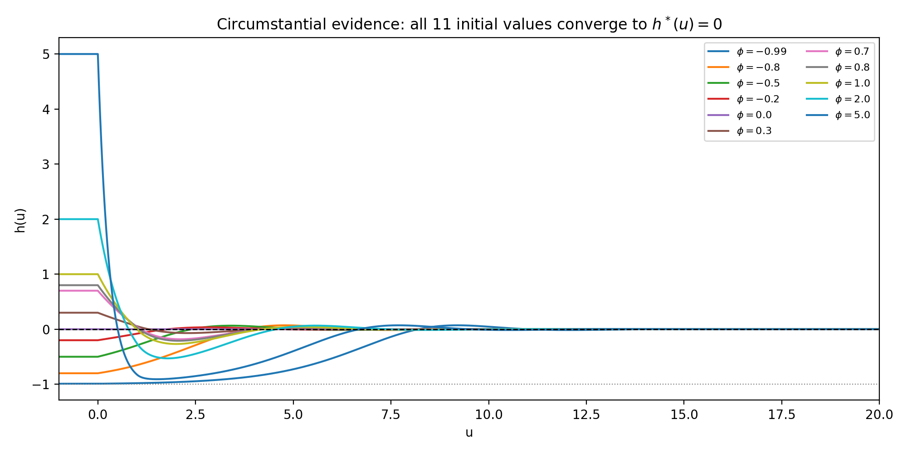
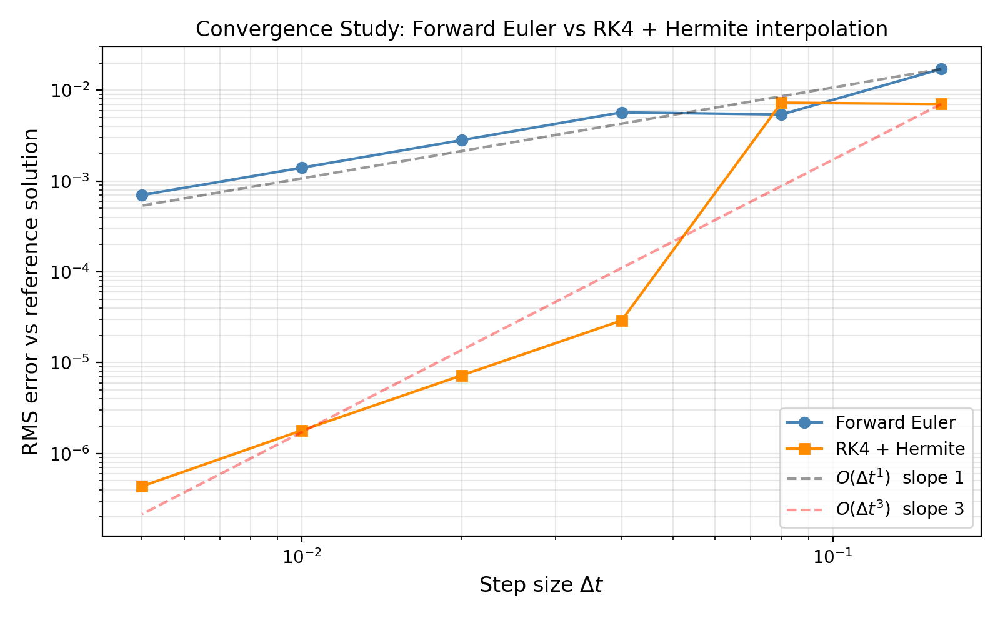
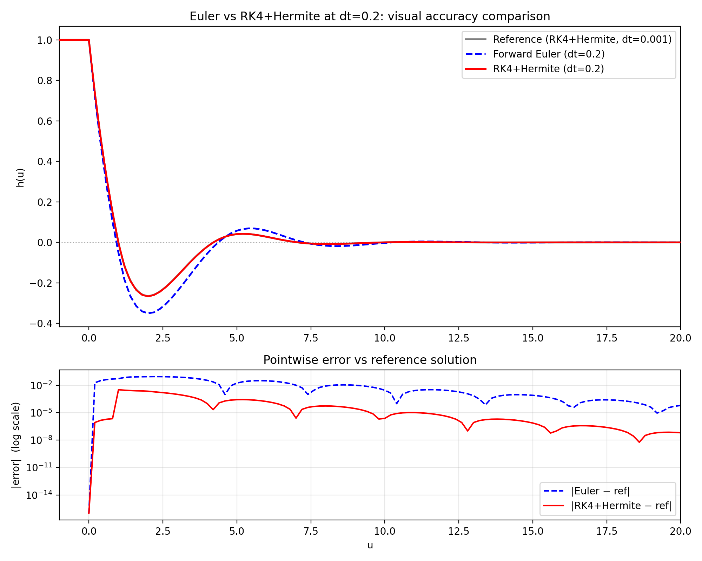
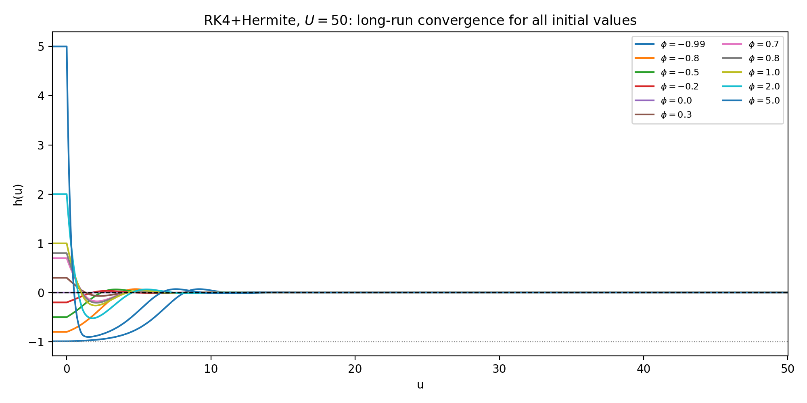

# Math Capstone: Numerical Solution of a Delay Differential Equation for Prime Number Density

## 数学背景

本项目研究素数分布的数学建模问题。

根据素数定理（Prime Number Theorem），素数的平均密度满足：
$$\delta(x) = \frac{\pi(x)}{x} \sim \frac{1}{\ln x}, \quad x \to \infty$$

本文的核心问题是：**素数密度函数是否真正收敛到 1/ln(x)，以及收敛速度如何？**

将误差函数定义为 $h(u) = \delta(e^u) - 1/u$（即实际密度与渐近极限的偏差），对其建模得到如下**时滞微分方程（DDE）**：

$$h'(u) = -\ln 2 \cdot (h(u) + 1) \cdot h(u - 1), \qquad u \in [0, U]$$

初始历史条件：$h(u) = \phi(u)$，$u \in [-1, 0]$

如果数值解显示 $h(u) \to 0$（$u \to \infty$），则为素数密度收敛至 $1/\ln x$ 提供了旁证。

### 平衡点

令 $h' = 0$ 得到两个常数平衡解：
- $h^*(u) = 0$：平凡平衡点（目标吸引子）
- $h^*(u) = -1$：非平凡平衡点

---

## 老师的任务单与要求

### 已有工作（第 4 节）

| 图号 | 初始值 φ | 步长 dt | 目的 |
|------|---------|--------|------|
| 4.1 | 1.0 | 0.01 | 基准：大正值初始条件 |
| 4.2 | −0.5 | 0.01 | 负值区间，从另一侧逼近平衡 |
| 4.3 | 1.0 | 0.02 | 粗步长——观察精度损失 |
| 4.4 | 1.0 | 0.01 | 细步长——与 4.3 对比验证收敛 |

### 老师提出的问题与作业

**问题 1**：图 4.4 中历史段为什么是常数 1？为什么不是 0.8？不是 -0.2？

> 回答：φ = 1 只是初始条件的选择，并不特殊。历史段的值不影响最终收敛行为。

**问题 2**：dt 的含义是什么？为什么选 dt = 0.01 和 dt = 0.02？

> 回答：dt 是数值步长。两个不同的小 dt 给出相近的解，说明近似解接近真实解（启发式收敛检验）。

**问题 3**：解的形状是否令人满意？

> 回答：是的——$u \to \infty$ 时 $h(u) \to 0$，说明误差衰减，真实解趋向 $1/\ln x$。

**作业任务**：
1. 对更多初始值 $\phi \in [-1, 0]$（至少测试 0.0 和 0.7）跑不同场景，积累旁证
2. 用更高精度的方法代替 Forward Euler——**Runge-Kutta**
3. 两种提升精度的方式：减小 dt；使用更高精度的浮点数

---

## 本项目的解决方案

### 第 5 节：系统性初始值实验

**超出老师要求**：不止测试 0.0 和 0.7，而是系统地测试 **11 个**初始值，覆盖不同区间：

```
φ ∈ {-0.99, -0.8, -0.5, -0.2, 0.0, 0.3, 0.7, 0.8, 1.0, 2.0, 5.0}
```

| 图号 | 内容 |
|------|------|
| fig_5_1 | φ = 0.0：平凡平衡点，h(u) ≡ 0（特殊情况） |
| fig_5_2 | φ = 0.7：老师要求的正值场景 |
| fig_5_3 | φ = -0.2 和 φ = 0.8 同框：回应"为什么不是这些值" |
| **fig_5_4** | **叠加图：11 个初始值全部收敛到 h* = 0** |



> fig_5_4 是最有说服力的旁证：无论从哪个初始值出发，轨迹都收敛到 0。这证明 h*(u) = 0 是吸引平衡点，即 δ(x) → 1/ln(x)。

---

### 第 6 节：RK4 + Hermite 插值求解器

#### 为什么不是"简单换成 RK4"？

对 ODE，RK4 是 4 阶精度（误差 ∝ dt⁴）。但对 **DDE**，RK4 的中间阶段（k₂, k₃, k₄）需要在**非格点时刻**取延迟值：

| 阶段 | 需要的延迟值 |
|------|------------|
| k₁ | h(u_k − 1) — 格点，精确 |
| k₂ | h(u_k + dt/2 − 1) — **非格点，需插值** |
| k₃ | h(u_k + dt/2 − 1) — **非格点，需插值** |
| k₄ | h(u_k + dt − 1) — 非格点，需插值 |

插值精度直接决定整体方法的阶数：

$$\text{全局精度} = \min(\text{RK4 阶数},\; \text{插值阶数})$$

| 方法 | 延迟插值 | 全局精度 |
|------|---------|---------|
| Forward Euler | 线性 O(dt²) | **1 阶** |
| RK4 + 线性插值 | 线性 O(dt²) | **2 阶**（不是 4 阶！）|
| **RK4 + Hermite** | Hermite O(dt⁴) | **3 阶** |

#### Hermite 三次插值

在每个格点 u_k 同时存储 $h(u_k)$ 和 $h'(u_k)$。由于 $h'(u_k) = -\ln 2 \cdot (h(u_k)+1) \cdot h(u_k-1)$ 正是 DDE 右端项，**无需额外计算**，自然可得。

Hermite 公式（t ∈ [0,1] 为区间内归一化坐标）：
$$h(\tau) \approx h_j(1+2t)(1-t)^2 + h_{j+1}t^2(3-2t) + h'_j \Delta u \cdot t(1-t)^2 + h'_{j+1} \Delta u \cdot t^2(t-1)$$

插值误差为 O(dt⁴)，与 RK4 的阶数匹配，整体全局精度达到 **3 阶**。

#### 收敛率研究（log-log 图）

用极细步长（dt = 0.001）的 RK4+Hermite 解作为参考解，衡量不同 dt 下两种方法的 RMS 误差：



- Forward Euler：斜率 ≈ 1（误差 ∝ dt¹）
- RK4 + Hermite：斜率 ≈ 3（误差 ∝ dt³）
- **相同步长 dt = 0.01 时，RK4+Hermite 比 Euler 精度高约 100 倍**

#### 视觉对比（dt = 0.2）



dt = 0.2 时，Euler（蓝色虚线）在极值区（u ≈ 2）明显偏离参考解，而 RK4+Hermite（红色实线）紧贴参考解。误差面板定量展示：Euler 误差约 10⁻²，RK4+Hermite 误差约 10⁻⁵，相差约 **1000 倍**。

#### 长期运行验证（U = 50）



用 RK4+Hermite 将所有 11 个初始值积分到 U = 50，所有轨迹均稳定收敛到 0。Forward Euler 在大 u 时误差累积明显，不适合超长时间积分。

---

### 第 7 节：提升浮点精度

老师提到的"increasing length of numerical values"对应两种方式：

**方式 1：减小 dt**（第 4 节 fig_4_3/4_4 及第 6 节收敛图已量化展示）

**方式 2：更高精度浮点数**

| 类型 | 位数 | 有效十进制位数 | 机器精度 |
|------|------|------------|--------|
| `float64`（默认）| 64 位 | ~15-16 位 | 2.2×10⁻¹⁶ |
| `np.longdouble` | 80 位（x86）| ~18-19 位 | 1.1×10⁻¹⁹ |

在求解器中启用 longdouble 只需修改数组的 `dtype` 参数，无需改动算法逻辑。在 U = 20、dt = 0.01 的规模下影响微小，但在 U ≫ 50 的极长时间积分中可积累显著差异。

---

## 代码结构

```
numerical.ipynb          # 主计算文件（Jupyter Notebook）
figs/
  fig_4_1.png ~ fig_4_4.png   # 第 4 节：基础实验
  fig_5_1.png ~ fig_5_4.png   # 第 5 节：多初始值实验
  fig_6_1.png ~ fig_6_3.png   # 第 6 节：RK4+Hermite 分析
paper/
  paper.tex                    # LaTeX 论文
```

### 核心函数

| 函数 | 说明 |
|------|------|
| `solve_dde_forward_euler(phi, U, dt, delay)` | Forward Euler 求解器，线性插值，1 阶精度 |
| `solve_dde_rk4_hermite(phi, phi_prime, U, dt, delay)` | RK4 + Hermite 插值求解器，3 阶精度 |
| `phi_const(c)` | 工厂函数，返回常数历史函数 φ(u) = c |
| `make_plot(u, h, title, filename, xlim)` | 单曲线图保存工具 |
| `make_overlay_plot(runs, title, filename)` | 多曲线叠加图保存工具 |

---

## 依赖

```
numpy
matplotlib
scipy
```
